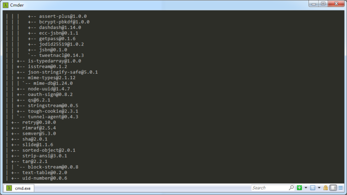
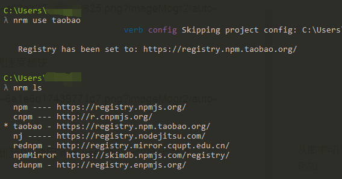

## 技巧一

我们经常使用`npm ls`的时候会看见长篇的文件树结构，完全看不清自己安装了什么模块，这时候我们可以使用`npm ls --depth=0`查看安装的模块，会发现安装结构变的很清晰明了

例如使用：`npm ls -g`

<!-- more -->



使用`npm ls -g --depth=0`


## 技巧二

使用`npm install`下载速度简直让人抓狂，这时候我们可以使用`nrm`来管理`node`的代理，加快下载速度

### 安装nrm

使用npm安装nrm
```cmd
npm install -g nrm --registry=https://registry.npm.taobao.org
```

使用命令行`nrm ls`查看nrm的代理列表，未选中代理之前默认使用的是“npm”源，我这里已经切换到了`taobao`源


使用命令行`nrm test`测试各代理源的速度，延迟越低，下载速度越快


从图中可以看出当前的taobao源的下载速度最快，这时候我们可以使用`nrm use`命令行切换代理源
例如：
```cmd
nrm use taobao
```



-EOF-
