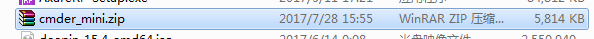

## CMDER的安装

### 下载CMDER

打开[GITHUB](https://github.com)，搜索`cmder`，进入`cmder`的项目主页


选择GITHUB的版本发布选项，打开版本发布界面


选择一个发布版，进行下载


当前最新版下载地址：[v1.3.2下载地址](https://github.com/cmderdev/cmder/releases/download/v1.3.2/cmder_mini.zip)

<!-- more -->

### 安装CMDER

等待下载完成，将下载的压缩包解压，例如我将压缩包解压到“C盘”




## 配置环境变量

打开控制面板


选择系统


打开高级系统设置


打开环境变量配置


新建变量名“CMDER_HOME”，变量值为CMDER解压后的根路径
例如：
变量名：`CMDER_HOME`
变量值：`C:\Users\****\AppData\Local\cmder_mini`


将CMDER_HOME配置到Path中

例如：`%CMDER_HOME%`（注意，Path变量值如果是在最后，则不用打“`;`”）


## 验证CMDER是否安装成功

使用`Win+R`键，打开运行界面，输入`cmder`，运行正常则`cmder`安装成功


## 将CMDER加入Windows的右键菜单中

在管理员权限的终端输入命令行`Cmder.exe /REGISTER ALL`即可将`cmder`加入到Windows的右键菜单中


输入命令行
```cmd
Cmder.exe /REGISTER ALL
```

效果图如下


-EOF-
