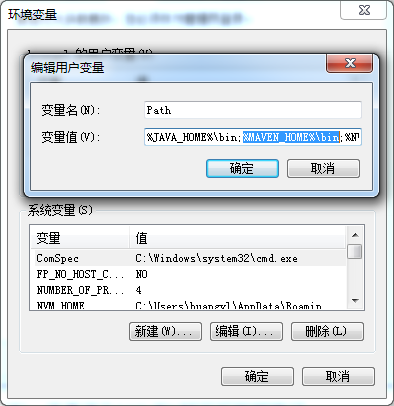

## MAVEN的安装

### 下载MAVEN

使用百度搜索关键字“Maven”


或者直接打开网址： [http://maven.apache.org/](http://maven.apache.org/)

<!-- more -->

选择“Download”界面


选择一个版本进行下载


当前最新版下载地址：[v3.5.0](http://mirrors.hust.edu.cn/apache/maven/maven-3/3.5.0/binaries/apache-maven-3.5.0-bin.zip)

### 安装MAVEN

等待下载完成，将下载的压缩包解压，例如我将压缩包解压到“D盘”


## 配置环境变量

打开控制面板


选择系统


打开高级系统设置


打开环境变量配置


新建变量名“MAVEN_HOME”，变量值为MAVEN解压后的根路径
例如：
变量名：`MAVEN_HOME`
变量值：`D:\apache-maven-3.5.0`


将MAVEN_HOME配置到Path中

例如：`%MAVEN_HOME%\bin`（注意，Path变量值如果是在最后，则不用“`;`”）



## 验证MAVEN是否安装成功

使用`Win+R`键，打开运行界面，输入`cmd`，打开控制台


在控制台中输入`mvn --version`，有输出MAVEN信息时，你的MAVEN就安装成功了，反之则不成功


## MAVEN的配置

打开MAVEN根目录下conf文件夹中的settings.xml文件


### 修改MAVEN本地仓库地址

`settings.xml`中的`settings > localRepository`可以修改MAVEN的本地仓库地址
例如，我修改的是
```xml
<localRepository>E:/.m2/repository</localRepository>
```
### 修改MAVEN代理配置

`settings.xml`中的`settings > mirrors`可以修改MAVEN的代理配置
例如，我修改的是
```xml
<mirror>  
  <id>nexus-aliyun</id>
  <mirrorOf>*</mirrorOf>
  <name>Nexus aliyun</name>
  <url>http://maven.aliyun.com/nexus/content/groups/public</url>
</mirror>
```

-EOF-
