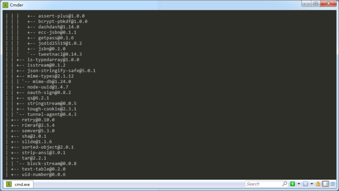
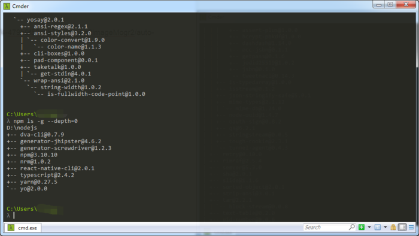

## 技巧一：简化查询NODE.JS的文件树结构

我们经常使用 `npm ls` 的时候会看见长篇的文件树结构，完全看不清自己安装了什么模块，这时候我们可以使用 `npm ls --depth=0` 查看安装的模块，会发现安装结构变的很清晰明了

例如使用：`npm ls -g`

<!-- more -->



使用 `npm ls -g --depth=0`



## 技巧二：使用nrm来管理NODE.JS的代理

使用 `npm install` 下载速度简直让人抓狂，这时候我们可以使用nrm来管理NODE.JS的代理，加快下载速度

### 安装nrm

使用npm安装nrm
```bash
$ npm install -g nrm --registry=https://registry.npm.taobao.org
```

使用命令行 `nrm ls` 查看nrm的代理列表，未选中代理之前默认使用的是 `npm` 源，我这里已经切换到了 `taobao` 源


使用命令行 `nrm test` 测试各代理源的速度，延迟越低，下载速度越快


从图中可以看出当前的taobao源的下载速度最快，这时候我们可以使用 `nrm use` 命令行切换代理源
例如：
```bash
$ nrm use taobao
```


## 技巧三：管理npm配置文件

### 常用命令行

- 设置配置项：`npm config set <key> <value>`
- 删除配置项：`npm config delete <key>`
- 获取配置项的值：`npm config get <key>`
- 显示当前配置：`npm config list`

### 常用代理地址

- 淘宝 `NPM` 镜像地址：[https://npm.taobao.org](https://npm.taobao.org)
- 开源镜像：[https://npm.taobao.org/mirrors](https://npm.taobao.org/mirrors)

### node-sass的代理配置

使用命令行：
```bash
$ npm config set SASS_BINARY_SITE "http://npm.taobao.org/mirrors/node-sass/"
```

-EOF-
