## IDEA的安装

### 下载IDEA

打开IDEA的官网：[https://www.jetbrains.com/idea/](https://www.jetbrains.com/idea/) 选择“DOWNLOAD”，跳转至下载界面

下载界面说明

这里我们选择“Ultimate（旗舰版）”下载进行安装演示，点击DOWNLOAD按钮，即可开始下载

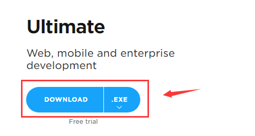

当前最新版下载地址：[v2017.2.2](https://download.jetbrains.com/idea/ideaIU-2017.2.2.exe)

<!-- more -->

### 安装IDEA

等待下载完成，双击下载完成的exe文件，打开安装界面

选择Next

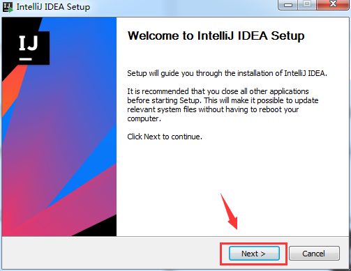

选择IDEA的安装目录，我这里是将IDEA安装到“D盘”

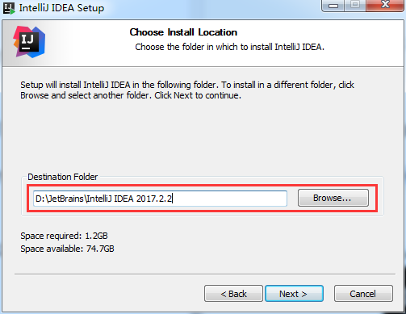

选择自己喜欢的配置，然后Next

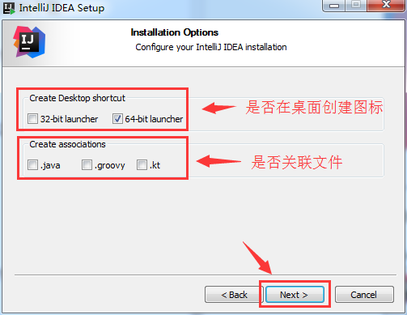

选择Install开始安装

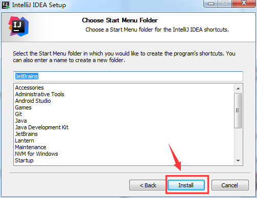

等待安装进度条结束后选择Finish，完成IDEA的安装

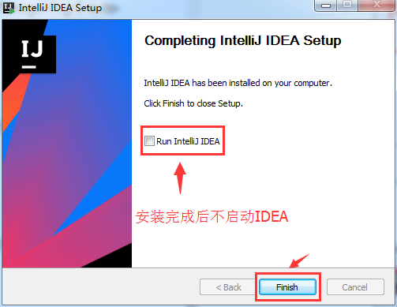

## IDEA的配置

点击IDEA的启动快捷方式，启动IDEA

单击OK按钮

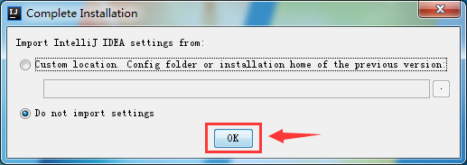

激活方式请自行百度

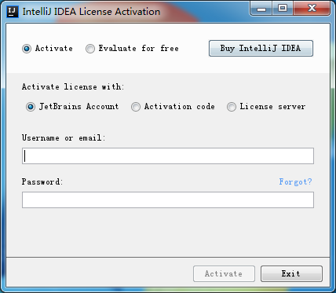

选择一个喜欢的主题，然后选择Next

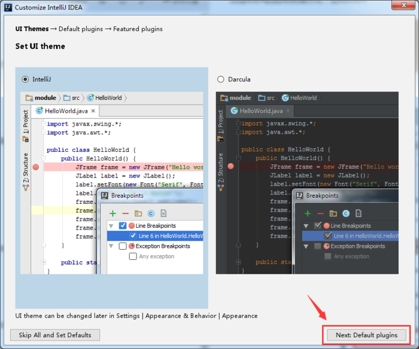

选择需要使用的插件，默认就好，然后选择Next

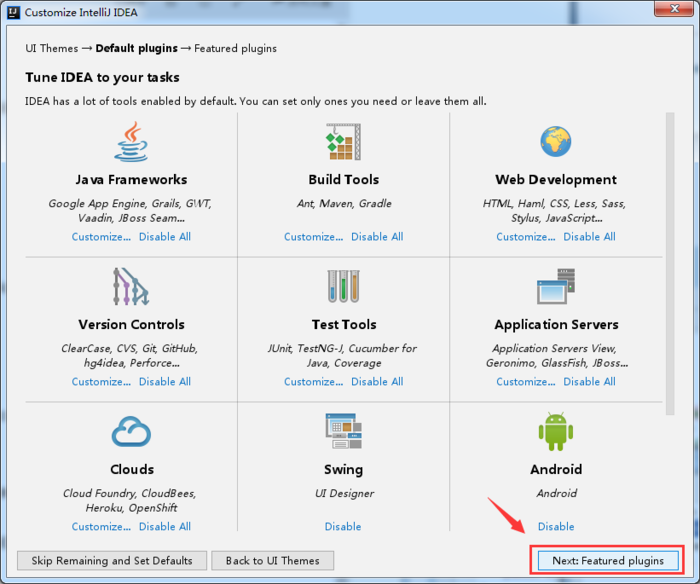

是否需要安装一些特殊插件的支持，默认就好，然后选择Next

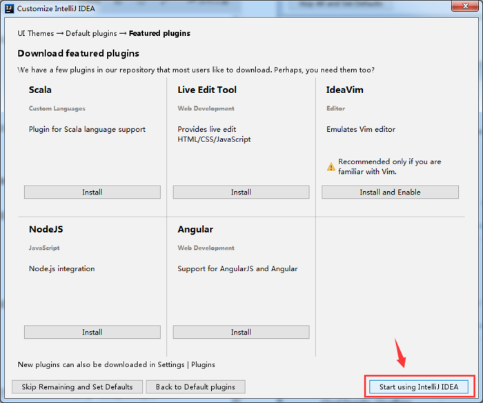

看到如下界面，代表IDEA配置完成

## IDEA的使用小技巧

### 关闭IDEA的自动升级

选择IDEA的Settings的选项，打开IDEA的设置界面

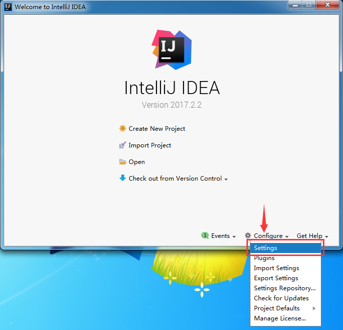

去掉IDEA的自动升级的功能

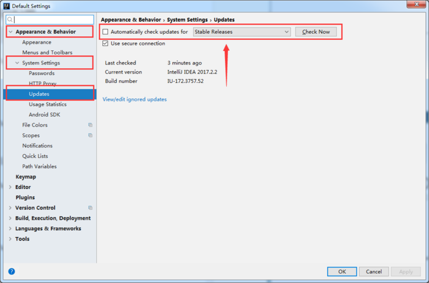

### 去掉拼写检查

选择IDEA的Settings的选项，打开IDEA的设置界面

去掉IDEA的拼写检查的功能

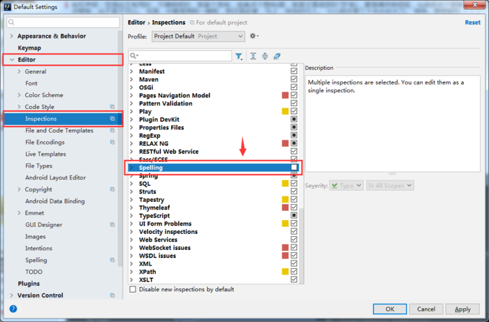

### IDEA每次启动不开启任何项目

选择IDEA的Settings的选项，打开IDEA的设置界面

去掉IDEA的自动启动最后关闭的项目的功能

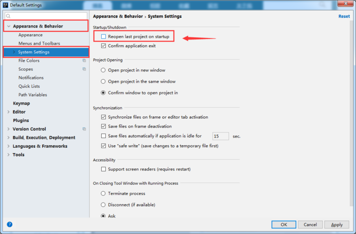

### 关闭IDEA确认退出选项

选择IDEA的Settings的选项，打开IDEA的设置界面

去掉关闭IDEA确认退出选项的功能

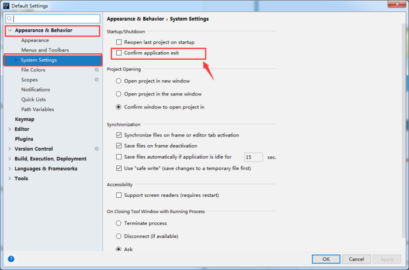

### 启动代码方法分割线

选择IDEA的Settings的选项，打开IDEA的设置界面

开启代码方法分割线的功能

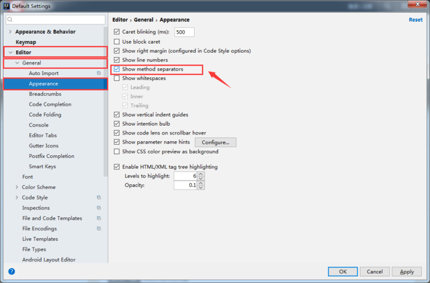

### 配置Tomcat

选择IDEA的Settings的选项，打开IDEA的设置界面

打开服务配置界面

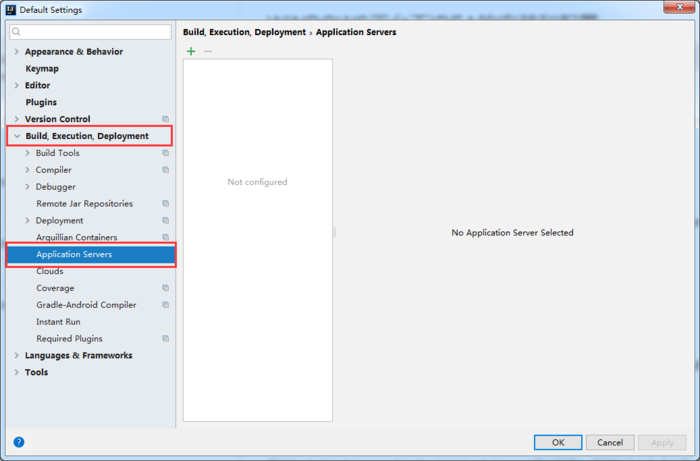

增加Tomcat服务

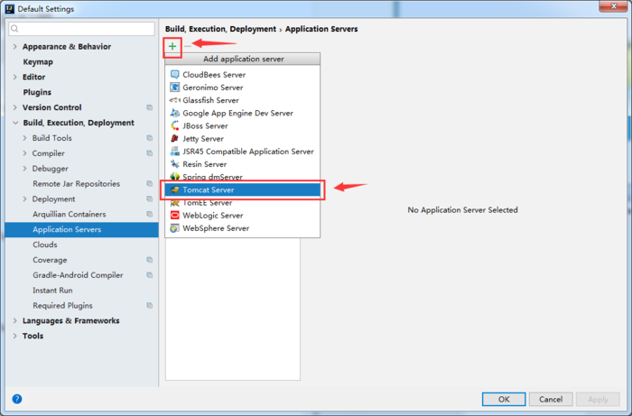

选择本机已安装的Tomcat服务

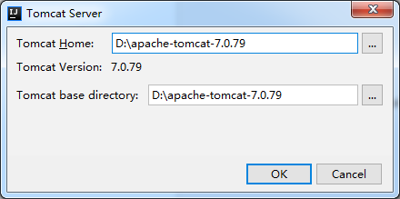

完成Tomcat的配置

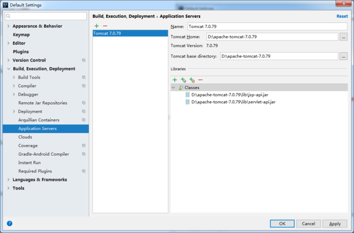

### 配置MAVEN

选择IDEA的Settings的选项，打开IDEA的设置界面

选择本机已安装的MAVEN地址

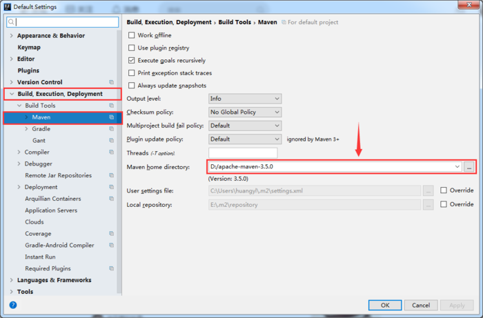

-EOF-
