## MySQL的安装

### 下载MySQL

使用百度搜索关键字“MySQL 官网”


或者直接打开网址：[https://www.mysql.com/](https://www.mysql.com/)

<!-- more -->

选择 `Downloads > Community > MySQL Community Server` 打开下载界面

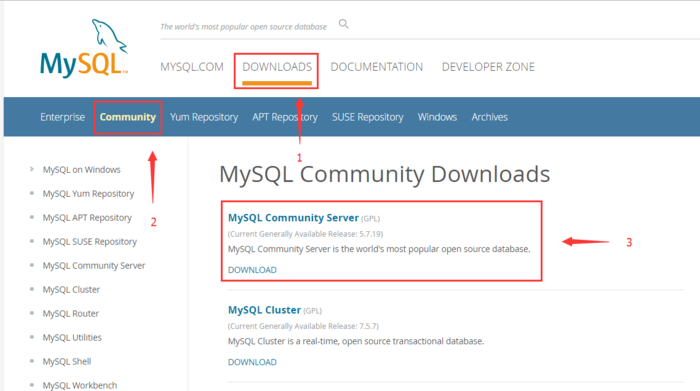

选择5.6的版本，因为5.7的安装比较坑

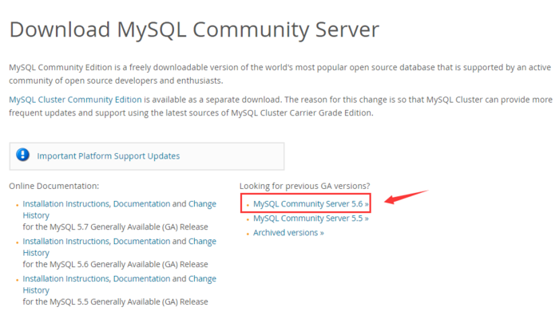

选择对应的平台，进行下载

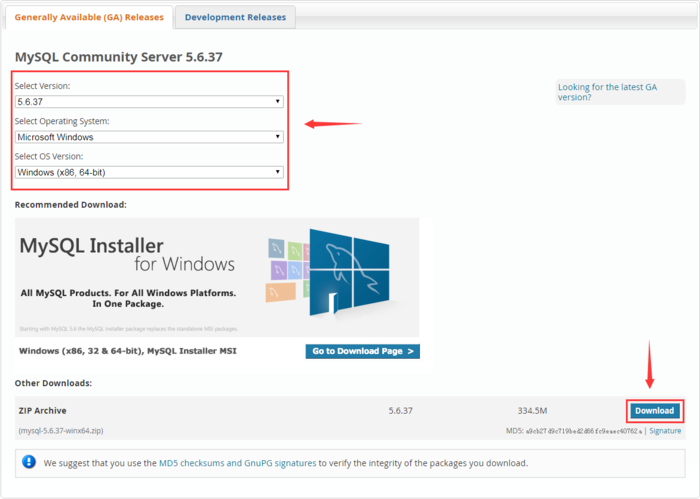

点击下载后，这里会看到一个准备开始下载的界面，点击 `No thanks, just start my download.` 就可以开始下载MySQL了


当前最新GA版下载地址：[v5.6.37](https://dev.mysql.com/get/Downloads/MySQL-5.6/mysql-5.6.37-winx64.zip)

### 安装MySQL

等待下载完成（由于时间关系，我就使用已经下载过的v5.6.31进行演示），将下载的压缩包解压，例如我将压缩包解压到“D盘”


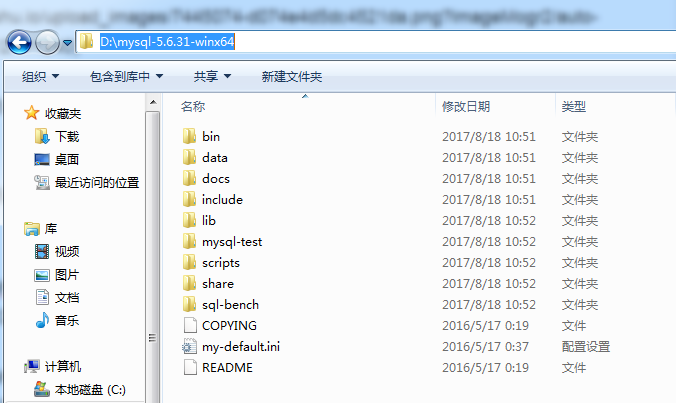

## 配置环境变量

右键单击我的电脑，选择属性，打开系统设置

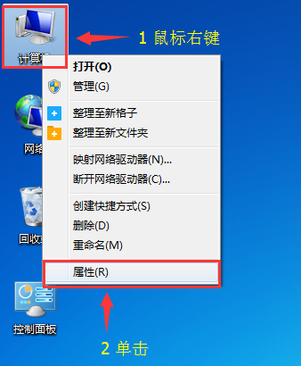

打开高级系统设置

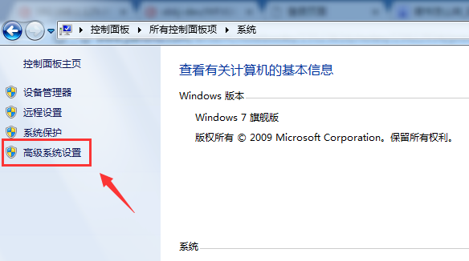

打开环境变量配置

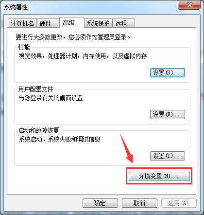

新建变量名“MYSQL_HOME”，变量值为MySQL解压后的根路径
例如：
变量名：`MYSQL_HOME`
变量值：`D:\mysql-5.6.31-winx64`

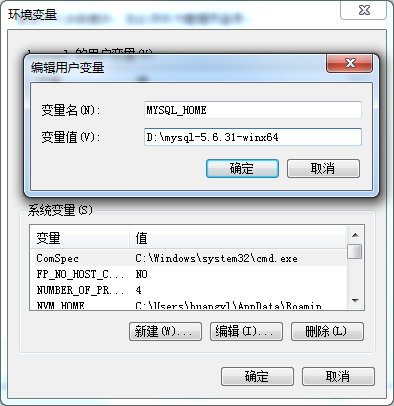

将MYSQL_HOME配置到Path中

例如：`%MYSQL_HOME%\bin`（注意，Path变量值如果是在最后，则不用“`;`”）

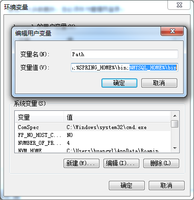

## 配置MySQL

编辑MySQL根目录下的 `my-default.ini` 文件

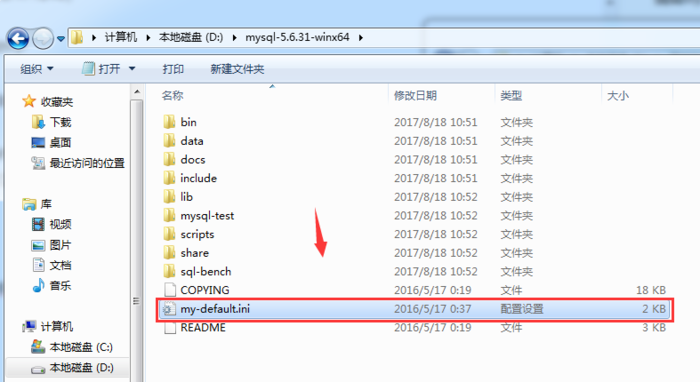


```ini
# For advice on how to change settings please see
# http://dev.mysql.com/doc/refman/5.6/en/server-configuration-defaults.html
# *** DO NOT EDIT THIS FILE. It's a template which will be copied to the
# *** default location during install, and will be replaced if you
# *** upgrade to a newer version of MySQL.
[mysql]
# 设置客户端默认字符集
default-character-set = utf8 

[mysqld]

# Remove leading # and set to the amount of RAM for the most important data
# cache in MySQL. Start at 70% of total RAM for dedicated server, else 10%.
# innodb_buffer_pool_size = 128M

# Remove leading # to turn on a very important data integrity option: logging
# changes to the binary log between backups.
# log_bin

# These are commonly set, remove the # and set as required.
# basedir = .....
# datadir = .....
# port = .....
# server_id = .....

# 设置服务端字符集
character-set-server = utf8
# 设置安装目录
basedir = %MYSQL_HOME%
# 设置数据存放目录
datadir = %MYSQL_HOME%\data
# 设置3306端口
port = 3306 

# Remove leading # to set options mainly useful for reporting servers.
# The server defaults are faster for transactions and fast SELECTs.
# Adjust sizes as needed, experiment to find the optimal values.
# join_buffer_size = 128M
# sort_buffer_size = 2M
# read_rnd_buffer_size = 2M 

# 设置数据模式
sql_mode=NO_ENGINE_SUBSTITUTION,STRICT_TRANS_TABLES 

```

## 初始化MySQL

打开拥有管理员权限的终端

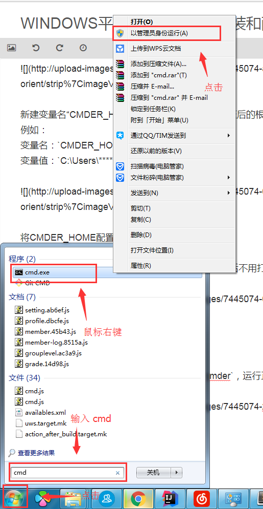

切换到MySQL的bin目录下

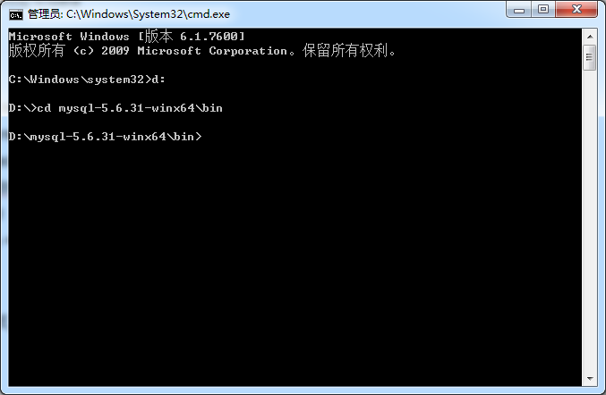

执行命令 `mysqld --install` ，看见 `Service successfully installed.` 代表MySQL初始化成功，否则初始化不成功

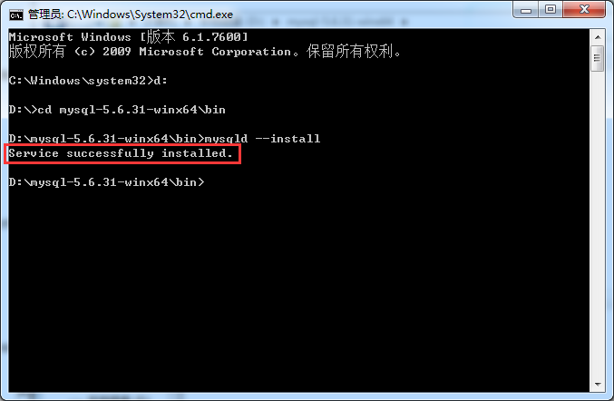

## 卸载MySQL

首先需要停止MySQL服务（如何停止MySQL的服务下面会将），然后打开拥有管理员权限的终端，切换到MySQL的bin目录下


执行命令 `mysqld --remove` ，看见 `Service successfully removed.` 代表MySQL卸载成功，否则卸载不成功

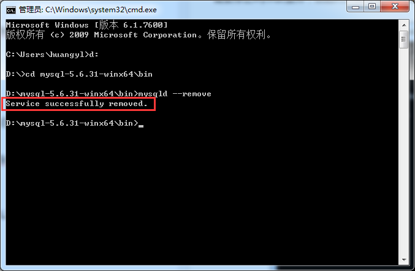

## 启动MySQL

使用 `Win+R` 键，打开运行界面，输入 `cmd` ，打开终端，输入 `net start mysql` ，看见“MySQL 服务启动成功时”，就代表MySQL服务启动成功了

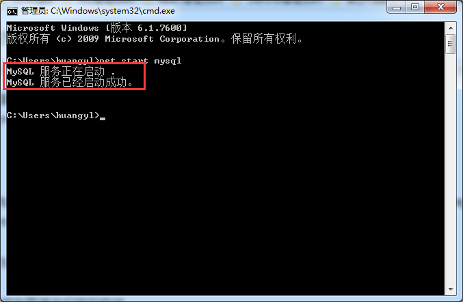

## 停止MySQL

使用 `Win+R` 键，打开运行界面，输入 `cmd` ，打开终端，输入 `net stop mysql` ，看见“MySQL 服务已成功停止”时，就代表MySQL服务停止成功了

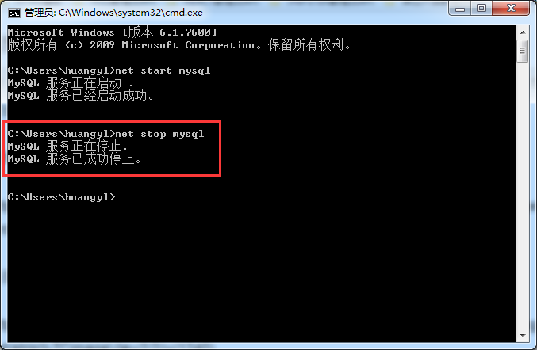

## 使用小技巧

### 登录MySQL

使用Win+R键，打开运行界面，输入cmd，打开终端，输入 `mysql -u 你的用户名 -p` ，MySQL的默认用户是root，密码为空
例如：`mysql -u root -p`

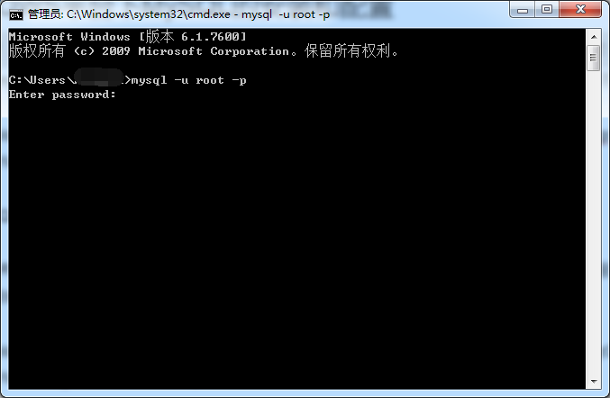

输入密码，若密码为空，直接回车即可

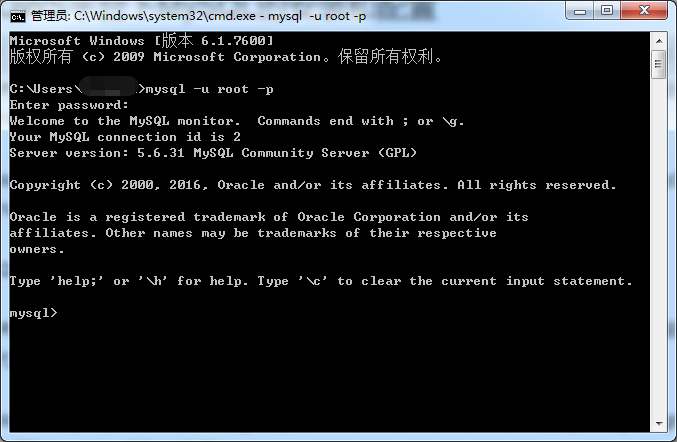

### 修改root用户的密码

使用root用户登录后，使用 `use mysql;` 命令切换到mysql数据库

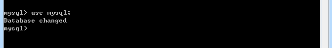

使用命令行`update user set password=password('你的密码') where user='root';`来修改root用户的密码
例如：`update user set password=password('1') where user='root';`

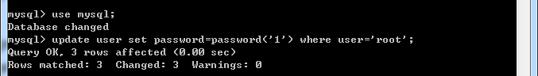

使用命令行 `flush privileges;` 使新配置的用户信息立即生效


### 允许任何IP访问MySQL的root用户

使用root用户登录后，使用 `use mysql;` 命令切换到mysql数据库


使用命令行 `select user,host from user;` 查询root用户的访问权限

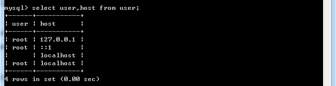

使用命令行 `grant all privileges on *.* to '需要设置的用户'@'允许访问的IP' identified by '访问的密码' with grant option;` 为MySQL增加一行访问权限
例如：`grant all privileges on *.* to 'root'@'%' identified by '1' with grant option;` IP设置成 `%` 的意思是允许任何IP的访问


使用命令行 `flush privileges;` 使新配置的权限立即生效


再次查询root用户的权限，这次已经多了一个 `%` 的权限了

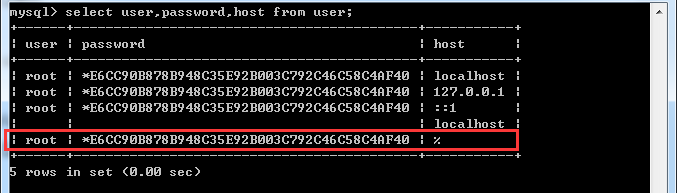

-EOF-
